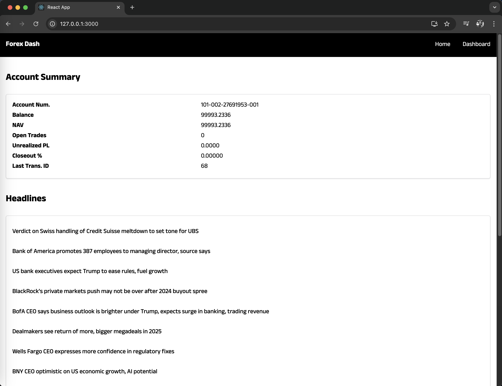
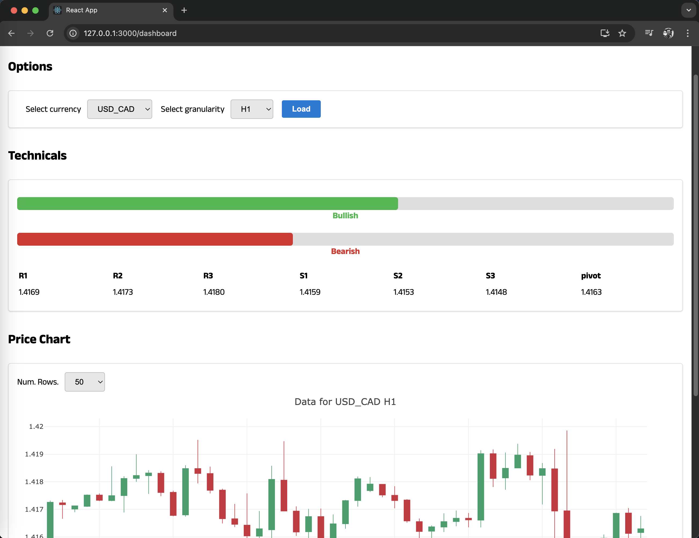

# Algorithmic Forex Trading and Backtesting System

Hey! Thanks for looking! The repository showcases the implementation of a robust trading bot, backtesting system, web scraping tools, and more.

---

## 📖 **Project Overview**

This project demonstrates how to:
- Develop a live trading bot capable of running 24/7.
- Backtest trading strategies across years of historical data.
- Integrate popular trading indicators like MACD, RSI, and Keltner Channels.
- Automate analysis by exporting results into visualized spreadsheets.
- Scrape the web for live sentiments, headlines, and economic data to make informed trading decisions.
- Build a React-based dashboard to monitor real-time prices and bot performance.
- Deploy the bot to a cloud environment for automated, scalable trading.

---

## 🚀 **Features**

### 🔄 **Live Trading Bot**
- **API Integration**: Connects to the Oanda REST API for real-time price streaming and trade execution.
- **Multi-threading**: Efficiently streams and processes live prices for faster decision-making.
- **Comprehensive Logging**: Tracks trading decisions and outcomes for performance analysis.

### 📊 **Backtesting System**
- **High-Speed Testing**: Tests thousands of trades per second over six+ years of data.
- **Indicator Implementation**: MACD, RSI, and Keltner Channels.
- **Parameter Optimization**: Tests multiple strategies and configurations for optimal performance.

### 🌐 **Web Scraping**
- Scrapes live market data, headlines, and economic calendars to influence trading strategies.
- Archives data in MongoDB for later analysis.

### 💻 **Web Dashboard**
- Built with **React** to display live prices, bot performance, and market data.
- Backend powered by **Flask** for seamless API integration.

### ☁️ **Cloud Deployment**
- Deploys the trading bot to cloud platforms for continuous operation.

---

## 🛠️ **Technologies Used**

| **Category**         | **Tools/Technologies**                                  |
|-----------------------|--------------------------------------------------------|
| **Programming**       | Python, JavaScript (React, Flask)                      |
| **Data Science**      | Pandas, Jupyter Notebooks                              |
| **Indicators**        | MACD, RSI, Keltner Channels                           |
| **Web Scraping**      | BeautifulSoup, Requests                                |
| **Databases**         | MongoDB                                               |
| **Deployment**        | AWS, GCP, or Heroku                                   |

---

## 📂 **Repository Structure**

```
📁 algorithmic-forex-trading
├── 📂 backtesting       # Scripts for backtesting strategies
├── 📂 live-trading-bot  # Code for live trading bot
├── 📂 web-scraping      # Scripts for scraping market data
├── 📂 web-dashboard     # React frontend and Flask backend
├── 📂 data-analysis     # Jupyter Notebooks for analysis
├── requirements.txt     # Python dependencies
└── README.md            # Project documentation
```

---

## ⚙️ **Setup and Installation**

### Prerequisites
1. Python 3.8 or higher
2. Node.js for React dashboard
3. MongoDB instance (local or cloud)
4. Oanda account and API key ([Setup Guide](https://www.oanda.com/))  

### Installation
1. Clone the repository:
   ```bash
   git clone https://github.com/pochiman/algorithmic-forex-trading.git
   cd algorithmic-forex-trading
   ```

2. Install Python dependencies:
   ```bash
   pip install -r requirements.txt
   ```

3. Navigate to the **web-dashboard** directory and install dependencies:
   ```bash
   cd web-dashboard
   npm install
   ```

4. Configure your `.env` file with Oanda API credentials.

5. Run the project:
   - **Backtesting**: `python backtesting/run_backtest.py`
   - **Live Bot**: `python live-trading-bot/start_bot.py`
   - **Web App**: `cd web-dashboard && npm start`

---

## 📊 **Sample Results**

### Backtesting
- Performance evaluation across multiple strategies and parameters.
- Visualized results in spreadsheets with tables and graphs.

### Live Bot
- Real-time trade execution with comprehensive logs.

### Web Dashboard
- Live updates of market data, bot status, and performance metrics.

---

## 🧑‍💻 **Key Learnings**

- Automating trading workflows using Python.
- Building a scalable, modular trading system.
- Integrating web scraping and data science techniques into trading strategies.
- Creating full-stack applications using React and Flask.
- Deploying systems to the cloud for continuous operation.

---

## 📜 **Disclaimer**

This repository is for educational purposes only. Algorithmic trading involves significant financial risk. Please exercise caution and use at your own discretion.

---

## 📬 **Contact**

If you have questions or feedback, feel free to reach out:

- **LinkedIn**: [pochiman](https://www.linkedin.com/in/pochiman/)

---

## 📸 **Samples**

#### forex home


#### forex dashboard

